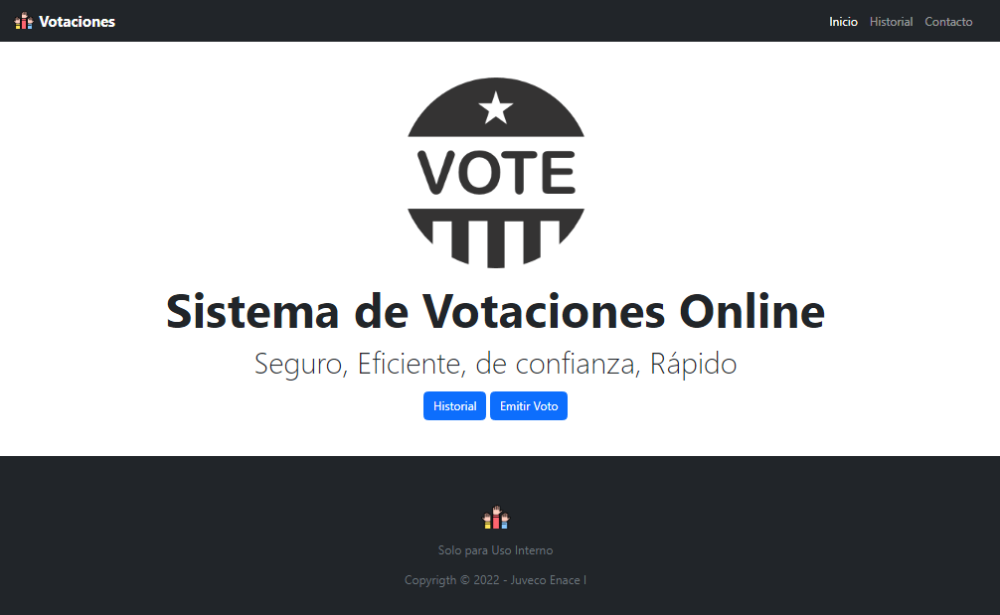
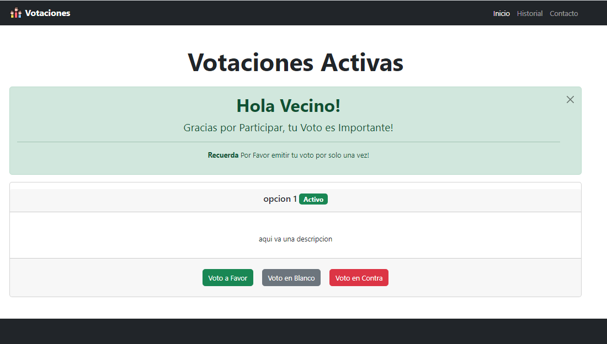
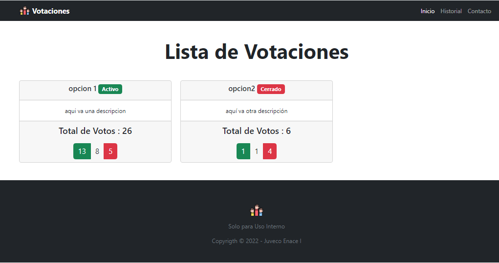
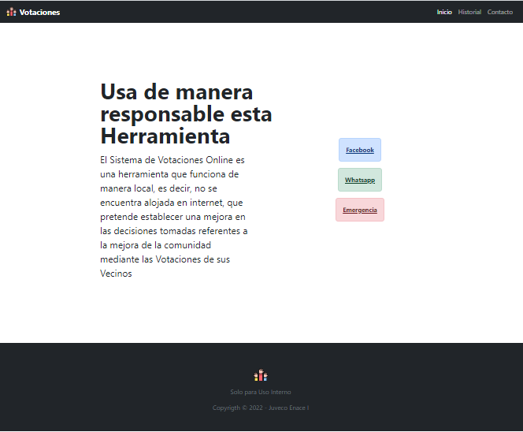
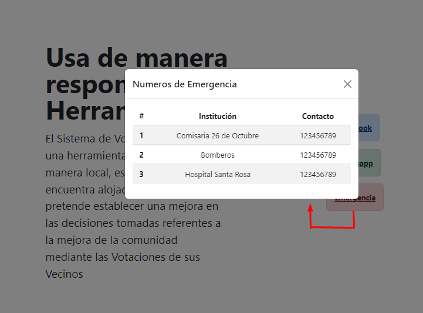

# Sistema de Votaciones Vecinales 

## Introducción

Este es un pequeño Sistema Web basado en Django para que te permite crear, gestionar, abrir y cerrar votaciones en vuestra localidad

## Pasos

### Habilitar el entorno virtual

1. Clona el proyecto desde tu terminal

2. Entra a la carpeta y ejecuta `pip -m virtualvenv venv`
    > Si no tienes instalado virtualvenv en tu computadora, instalalo de manera global con `pip install virtualvenv`

### Instalación y Migraciones 

1. Instala los requerimientos del sistema web con `pip install requierements.txt` aunque el sistema solo usa `django` tambien propias usar `pip install django`

2. Crea un super usuario para la base de datos con `python manage.py createsuperuser`

    > Nota: luego de crear puedes acceder a la base de datos atravez del localhost:8000/admin

3. Luego realiza las migraciones correspondientes ejecutando primero `python manage.py makemigrations` luego `python manage.py migrate`

### Vistas del Sistema Web

1. Vista Inicio 
    
    

2. Vista Emitir Voto - Votaciones activas
    
    

3. Vista Historial
    
    

4. Vista de Contacto 
    
    

    > Nota: se puede agregar numeros de emergencia
    
    

    <h3> 😊 Thanks for your visit! 😊</h3>
    

    This repository has been created with a lot of ❤️  
    ¡Come back soon!
    

    <small>Apoyame para seguir compartiendo material educacional</small>   
    

